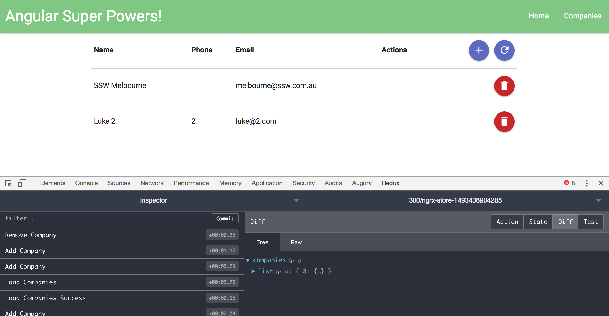

# NgSuperpowers

These are angular [SuperPowers](https://www.ssw.com.au/ssw/Events/Training/Angular-Superpowers-Tour.aspx) course notes!

(now with Redux!)

Tweet link: https://twitter.com/luketn/status/857773936062234624

## Tips

### Angular

#### ngrx
Use ngrx!

It's a great implementation of the redux pattern for Angular with observables.
https://github.com/ngrx/store

Spend some time learning the best practices from the example:
https://github.com/ngrx/example-app

Use @Effects to interact with remote services. They intercept actions and perform remote calls before dispatching actions on to the reducer. 

#### Loading Display
This is cool; have a loading message show until your observable resolves to data:
https://coryrylan.com/blog/angular-async-data-binding-with-ng-if-and-ng-else

#### Wallaby Unit Test Runner
Use this instead of Karma for instant feedback on tests as you write them.
https://wallabyjs.com/

#### fakeAsync for testing asynchronous behaviour without waiting!
https://angular.io/docs/ts/latest/api/core/testing/index/fakeAsync-function.html

### Visual Studio Commands

Command + C + V - duplicate line
Command + D{n} - highlight the same chars on the same line

### Visual Studio Code Extensions

#### Must haves!
Angular Language Service: Intellisense for Angular everywhere!
vscode-icons: Pretty icons for all the files!

#### Nice

##### John Papa's Angular 4 TypeScript Snippets
Search: publisher:"johnpapa" name"Angular v4 TypeScript Snippets"

## People

### Ulysses Maclaren
Great to meet the GM of SSW - Ulysses Maclaren:
https://www.linkedin.com/in/ulyssesmaclaren/?ppe=1

### Duncan Hunter
Course presenter and Software Architect Duncan Hunter
Blog: https://duncanhunter.com.au/

## Handy links

### Angular Team Weekly Notes
https://docs.google.com/document/d/1rC5dz7AkCZP813daT_bccbS-20OLmXgBVi50CSKx148/pub

### API for companies:
http://firebootcamp-crm-api.azurewebsites.net/api/company

### Publishing
ng build --output-path docs

## Advice for Infomedia!

### Migration from JS to TypeScript
It may be possible to do that, but there will be issues with RequireJS define() output to overcome. 
There would still be a benefit though, because you can have strong typing and compile errors etc...
Action: Investigate adding a TypeScript compile phase, perhaps using a gulp build that would run the TypeScript compiler and output a define() module for other code to consume.

